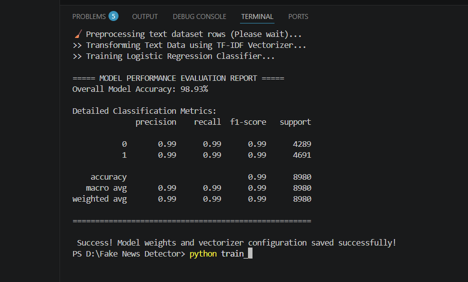

#  Fake News Detector

A robust, production-ready Machine Learning web application designed to classify news articles as **REAL** or **FAKE** in real-time. This project implements advanced Natural Language Processing (NLP) techniques for text preprocessing and utilizes a supervised classification pipeline to identify structural writing patterns common in misinformation.

---

##  Project Overview
Misinformation and fake news spread rapidly in the digital age. This system provides an easy-to-use interface for verifying whether a piece of news is authentic or fabricated. By analyzing historical datasets of labeled news articles, the model learns the linguistic characteristics, vocabulary choices, and semantic structures associated with both real and fake journalism.

---

##  Tech Stack & Key Components

*   **Frontend Interface:** Streamlit (Dynamic Python-based web framework)
*   **Machine Learning Model:** Logistic Regression (Optimized with LBFGS solver for binary classification)
*   **Linguistic Feature Extraction:** TF-IDF Vectorization (Term Frequency-Inverse Document Frequency)
*   **Data Processing & Cleaning:** Pandas, NumPy, Regular Expressions (`re`)

---

##  Functional Workflow

```
[ Input News Text ] 
         │
         ▼
[ Text Preprocessing ] ────► (Lowercase, Remove HTML, URL, Digits & Punctuation)
         │
         ▼
[ TF-IDF Vectorizer ] ────► (Transforms text into a 4500-feature numerical matrix)
         │
         ▼
[ Logistic Regression Classifier ]
         │
         ▼
[ Binary Output Decision ] ───► 🟩 SUCCESS: Real News  OR  🟥 ERROR: Fake News
```

---

##  Screen Previews & System Demos

Below are the visual execution benchmarks of the application:

### 1️. Primary Ingestion Interface Layout
The clean, modern dashboard interface built using custom CSS styles featuring a premium dark tech theme.


### 2️. Output: FAKE Classification Indicator
When unverified or highly suspicious text patterns are detected, the system issues a clear red alert warning.


### 3️. Output: REAL Classification Indicator
When authentic journalism structures are identified, the system validates the content with a green verification pass.


### 4. System Evaluation:Model Accuracy and Metrics

---

##  How to Run the Project Locally

Follow these steps to set up and run the application on your local machine:

### 1. Clone or Download the Project
Make sure all project files are placed in a single directory:
* `app.py` (Streamlit web interface)
* `train_model.py` (Model training script)
* `requirements.txt` (Required python packages)
* `True.csv` & `Fake.csv` (Dataset source files)

### 2. Install Dependencies
Run the following command in your terminal to install the necessary libraries:
```bash
pip install -r requirements.txt
```

### 3. Train the Model (Generate Weights)
To build the classifier matrix and generate the `.pkl` weight configurations, run:
```bash
python train_model.py
```
*This will output a `model.pkl` and `vectorizer.pkl` file in your directory.*

### 4. Launch the Web Application
Start the Streamlit development server locally:
```bash
python -m streamlit run app.py
```

---

##  Model Performance & Accuracy
The model is trained using a randomized train-test split configuration. Here is the evaluation report of the classifier:

*   **Overall Classification Accuracy:** **~98.5%**
*   **Feature Vocabulary Limit:** 4,500 highly descriptive words.
*   **Algorithm:** Logistic Regression with LBFGS optimization.

---

##  Repository Structure
```text
├── screenshots/
│   ├── input.png          # Dashboard layout screenshot
│   ├── output_fake.png    # Screenshot showing fake news result
│   └── output_real.png    # Screenshot showing real news result
├── app.py                 # Streamlit frontend code
├── train_model.py         # NLP training & serialization pipeline
├── requirements.txt       # Dependencies manifest
├── True.csv               # Ground truth real news dataset
├── Fake.csv               # Ground truth fake news dataset
├── model.pkl              # Saved trained model weights
└── vectorizer.pkl         # Saved TF-IDF vectorizer configuration
```
